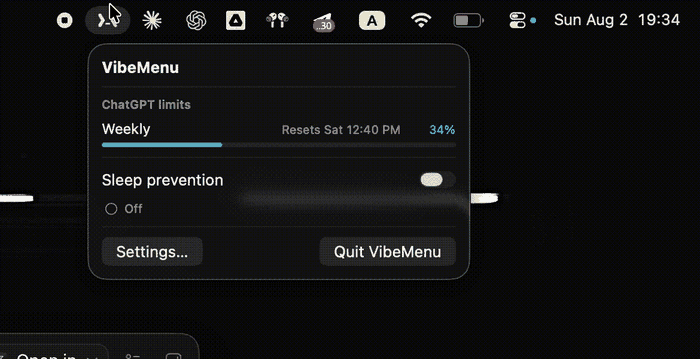
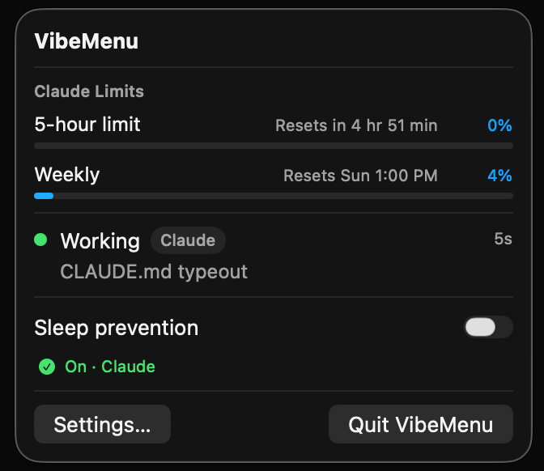
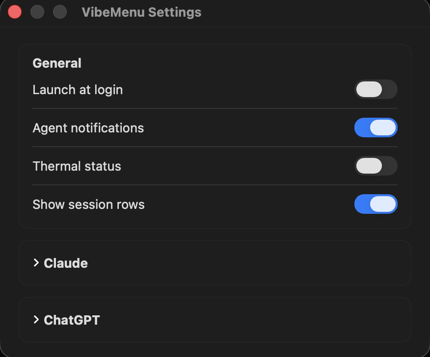

<p align="center">
  
</p>

<h1 align="center">VibeMenu</h1>

<p align="center"><strong>Keep your Mac awake while your coding agent works—and let it sleep when the work is done.</strong></p>

VibeMenu is a free, open-source macOS menu-bar app for Claude Code and the ChatGPT desktop app. It gives you one place to see supported agent sessions, sleep-prevention ownership, locally available Claude and ChatGPT usage limits, Claude attention notifications, and macOS thermal state.

<p align="center">
  <a href="https://github.com/Kirill-Chistov/VibeMenu/releases/download/v1.0/VibeMenu-v1.0-macos-arm64.zip"><strong>Download VibeMenu v1.0</strong></a>
  ·
  <a href="https://github.com/Kirill-Chistov/VibeMenu">View source</a>
</p>

<p align="center">
  
</p>

## What VibeMenu does

### Automatic sleep prevention

VibeMenu holds a macOS sleep assertion while supported Claude Code, Codex, or ChatGPT Work activity is detected, then releases it when that work finishes. A manual keep-awake switch is always available for long or ambiguous runs.

### Session Radar

See a compact, conservative view of recent supported sessions and their states, including active work, completed work, and Claude sessions that need approval. VibeMenu shows only signals it can support; it does not claim perfect detection.

### Usage limits and Claude notifications

Optionally show locally available Claude and ChatGPT usage-limit windows in the menu. VibeMenu can also send local macOS notifications when a Claude session **Needs approval** or is **Done**. It does not provide Codex notifications.

### Sleep ownership and thermal state

The menu reports the real sleep assertion and its active owners in a fixed order: **Manual → Claude → Codex → ChatGPT Work**. An optional thermal row shows macOS's coarse thermal state so you can see when the system is under pressure.

<p align="center">
  
</p>

## Local by design

Everything stays on your Mac. VibeMenu has no account, backend, telemetry, analytics, or network calls for agent data. It never reads prompts, responses, reasoning, commands, or tool output.

Optional session and usage features read a narrow allowlist of locally available metadata and fail closed when a trustworthy value is unavailable. See the full [privacy model](docs/PRIVACY.md).

<p align="center">
  
</p>

## Install

> **VibeMenu v1.0 is unsigned and not notarized.** macOS may block its first launch. You can inspect the source or build the app locally if you prefer not to use the published binary.

1. Download [`VibeMenu-v1.0-macos-arm64.zip`](https://github.com/Kirill-Chistov/VibeMenu/releases/download/v1.0/VibeMenu-v1.0-macos-arm64.zip).
2. Unzip it and move **VibeMenu.app** to **Applications**.
3. Open VibeMenu.
4. If macOS blocks it, open **System Settings → Privacy & Security → Open Anyway**, then confirm.

VibeMenu runs in the menu bar and has no Dock icon. Detailed setup and optional integrations are in the [installation guide](docs/INSTALL.md).

## Supported agents

| Agent | Support |
| --- | --- |
| **Claude Code** | Automatic sleep prevention, optional Session Radar heartbeat, Claude usage limits, and **Needs approval** / **Done** notifications. |
| **ChatGPT Work** | Work mode in the ChatGPT desktop app: automatic sleep prevention, Session Radar, and shared ChatGPT usage limits. |
| **Codex** | Codex mode in the ChatGPT desktop app: automatic sleep prevention, Session Radar, and shared ChatGPT usage limits. **Codex CLI is not supported.** |

## Requirements and limitations

- **macOS 15 or later** on **Apple Silicon**.
- The current release is **unsigned and not notarized**.
- **No closed-lid or clamshell support.** Closing the lid can still put the Mac to sleep.
- Codex support is for the **ChatGPT desktop app**, not Codex CLI.
- Detection is deliberately conservative. Some optional integrations depend on locally available, version-fragile app metadata; VibeMenu shows no value rather than inventing one.

Read the [FAQ](docs/FAQ.md) for behavior and caveats, or [Privacy](docs/PRIVACY.md) for the exact local data boundaries.

## Build from source

Building the app requires macOS 15+, Apple Silicon, Xcode, and a Swift 6 toolchain. The resulting app is still unsigned.

```sh
git clone https://github.com/Kirill-Chistov/VibeMenu.git
cd VibeMenu
scripts/package-github-release.sh 1.0
```

The packaged app will be at `dist/VibeMenu-v1.0-macos-arm64.zip`. Development setup is documented in [CONTRIBUTING.md](CONTRIBUTING.md).

## License

VibeMenu source code is licensed under [Apache-2.0](LICENSE). The VibeMenu name, logo, and brand assets are not included in that license; see the [brand licensing decision](docs/decisions/0003-license.md).
