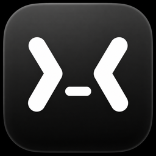

<p align="center"></p>

<h1 align="center">VibeMenu</h1>

<p align="center"><strong>Keeps your Mac awake while a coding agent is working, and tells you when one needs you.</strong></p>

<p align="center">
  
  
  
  
</p>

VibeMenu is a lightweight, local-first macOS menu-bar app — a **power-and-attention layer
for Mac-based coding agents**. It holds a macOS power assertion while Claude Code or a Codex
Desktop session is actually working, releases it when the work finishes, and shows you which
sessions are running, which are done, and which are blocked waiting for your approval.

It answers three questions at a glance:

- **Is this run protected from sleep?** — and who is holding the assertion right now.
- **Does any agent actually need me?** — an approval prompt surfaces as its own row.
- **Is it safe for the Mac to keep running?** — coarse thermal state as decision context.

<!--
  TODO(screenshot): docs/assets/vibemenu-menu.png is the v0.1.x menu (single "Claude:" row,
  no Session Radar, no assertion owners, no Codex) and no longer reflects the app, so it is
  deliberately not shown here. Capture a current menu and restore the image below.
-->

- ☕️ **Keeps your Mac awake while an agent works**, then lets it sleep when it finishes.
- 🔔 **Surfaces the session that's waiting on you** instead of making you check every window.
- 🖥️ **For macOS 15+ on Apple Silicon.**
- 🆓 **Free and open source** (Apache-2.0).
- 🔒 **Local-only** — no telemetry, no network, no backend, no account. Never reads your prompts.

> **Unsigned build.** VibeMenu is not code-signed or notarized. An Apple Developer ID is a
> recurring cost, and while the project is validating whether anyone wants it, that cost isn't
> justified — so releases stay unsigned for now. macOS warns on first launch; approving it once
> is a documented, one-time step (see [Install](#install)). You can also
> [build it from source](#develop) — same app, and you're trusting code you can read rather than
> a binary you can't. The build is still unsigned either way.

## What it does

- **Automatic keep-awake while an agent is working.** VibeMenu holds a power assertion while
  Claude Code — or an active Codex Desktop session — is working, and releases it when the work
  finishes. **For Claude**, a long silent phase (a build, a test run, a subagent/Task) keeps the
  Mac awake up to a bounded cap, so a quiet stretch doesn't drop the assertion mid-run. Codex
  has no equivalent hold — see [Limitations](#limitations).
- **Truthful sleep-prevention status.** The menu shows whether VibeMenu *actually* holds the
  assertion, who owns it (Manual / Claude / Codex), and when acquisition failed — rather than
  just echoing your switch back at you.
- **One-click manual keep-awake.** Manual always wins and is never overridden by automation.
- **Session Radar** — a shared **four-row** list of recent Claude Code and Codex Desktop sessions
  with their state (working / quiet / waiting / done / stale), elapsed time, and a safe session name.
  One centralized, provider-neutral **Recent sessions** expansion reveals additional rows. Rows can
  be hidden; nothing is written to disk.
- **Needs approval** *(Claude, opt-in hook)* — when Claude asks permission to run a tool, its row
  moves to the top and shows how long it's been blocked, and the **menu-bar icon turns orange** for a
  genuine approval request. Requires the optional heartbeat hook. See [the caveat below](#limitations).
- **Attention notifications** *(Claude, opt-in)* — optional local notifications when a Claude session
  hits **Needs approval** or is **Done**, using your Mac's own notification, Focus, and sound settings.
  Nothing is sent anywhere.
- **Usage limits** *(opt-in, experimental)* — your **real** Claude 5-hour/weekly usage (the same
  figures as the in-app `/usage` view) and Codex's real rate-limit windows, read **locally** from
  files those apps already wrote — **no network, no cookies, no API keys, no token estimation**.
  Off by default. See [`decisions/0016`](docs/decisions/0016-claude-usage-limits.md) and
  [`0017`](docs/decisions/0017-codex-session-support.md).
- **Stays out of the way** — menu-bar only (no Dock icon), optional Launch at Login, no network.

## Why not just use `caffeinate`?

`caffeinate`, [Amphetamine](https://apps.apple.com/app/amphetamine/id937984704), and
[KeepingYouAwake](https://keepingyouawake.app) are good general-purpose keep-awake tools.
VibeMenu is narrower on purpose: it's **agent-aware**. It releases sleep prevention when the
agent finishes, shows which session is doing what, and flags the one that's blocked on you —
filling the gap between "keep my Mac awake" and "don't keep it awake forever."

| Tool | Keeps Mac awake | Releases when the agent finishes | Shows agent status | Flags "needs approval" |
|---|---:|---:|---:|---:|
| caffeinate | ✅ | ❌ manual/scripted | ❌ | ❌ |
| Amphetamine / KeepingYouAwake | ✅ | ❌ manual | ❌ | ❌ |
| VibeMenu | ✅ | ✅ | ✅ | ✅ Claude, opt-in |

## Install

VibeMenu is distributed directly via **GitHub Releases** — no Mac App Store or Homebrew.

1. Download the `VibeMenu-v<version>-macos-arm64.zip` asset from the
   [latest release](../../releases/latest).
2. **Unzip** it (double-click in Finder) — you'll get **VibeMenu.app**.
3. **Move `VibeMenu.app` to `/Applications`.**
4. **Open it.** The build is unsigned and not notarized, so macOS blocks the first launch with a
   warning like *"Apple could not verify VibeMenu is free of malware."* To approve it:
   - Open **System Settings → Privacy & Security**, scroll to the **Security** section, and
     click **Open Anyway** next to the VibeMenu message, then confirm.
   - You only need to do this once. After that VibeMenu opens normally.
5. VibeMenu runs as a **menu-bar icon** — there is no Dock icon and no main window (opening
   **Settings…** shows a settings window).
6. Optionally open **Settings… → Launch VibeMenu at login** to start it automatically.

> **Note:** each tagged release corresponds to the binary attached to it; `master` may later move
> ahead of the latest tag. If you want exactly what's on `master`, [build from source](#develop).

Full step-by-step, uninstall, the optional Claude heartbeat hook, and the opt-in usage sources:
**[docs/INSTALL.md](docs/INSTALL.md)** · Common questions: **[docs/FAQ.md](docs/FAQ.md)**.

## Privacy

VibeMenu runs **entirely on your Mac**.

- **Local-only** — no backend, no account. **No network calls.** **No telemetry, no analytics** —
  not even opt-in.
- **Never reads your prompts or responses.** Detection uses process presence and file
  *modification times* (metadata) under `~/.claude`, plus — if you install the optional hook — an
  event name, session id, and project folder name that VibeMenu writes itself.
- **Session names are titles only.** To label a row, VibeMenu reads a session's **title** and
  nothing else — never prompt text, responses, `lastPrompt`, tool I/O, or any message body. The
  opt-in Claude Desktop title source and Codex's `thread_name` index are likewise title-metadata
  only, and are never touched while off.
- **Folder names, never paths.** VibeMenu shows the final project folder name; full working
  directories are discarded.
- **Opt-in sources do nothing while off.** With usage limits and Codex tracking off (the
  defaults), VibeMenu never opens those files at all.

Nothing ever leaves your Mac. See [docs/PRIVACY.md](docs/PRIVACY.md) for the full model,
including exactly which fields each parser reads.

## Limitations

- **Not signed or notarized** — Gatekeeper warns on first open (see [Install](#install)). This is
  a cost decision for the project's current validation phase, not a pending task;
  [build from source](#develop) if you prefer.
- **"Needs approval" is Claude-only and needs the opt-in hook.** It relies on Claude Code's
  `PermissionRequest` hook event, and clears when that session's **next** lifecycle event
  arrives — so approving clears the row on the next event, not the instant you click Allow.
  Denying is worse: Claude Desktop fires **no hook event on deny**, so a denied row can linger
  until that session's next event (or the 30-minute prune).
- **Codex support is Desktop-only and read-only.** Codex **CLI** sessions are ignored. Codex
  usage limits never affect sleep prevention.
- **No quiet-work hold for Codex.** Codex exposes no per-session heartbeat, so VibeMenu can't
  tell "silent mid-build" from "finished". A Codex session holds sleep prevention only while it
  looks actively working; once it's quiet for about a minute, the hold drops. The 15-minute
  quiet-work hold is **Claude-only**. For a long silent Codex phase, use the manual switch.
- **Opt-in sources read other apps' private files.** The Claude Desktop cache/title index and
  Codex's rollout files are undocumented formats. They're best-effort: if a vendor changes the
  format, VibeMenu shows nothing rather than guessing.
- **No clamshell / lid-closed support.** Closing the lid can still sleep the Mac.
- **Does not prevent display sleep.** VibeMenu keeps the *system* awake, not the screen.
- **No exact temperature or fan-speed reading.** The thermal row shows macOS's coarse thermal
  *state* (Nominal / Fair / Serious / Critical), not degrees or RPM.
- **During long quiet work a Claude row may read *Quiet* while sleep prevention stays
  active.** That's the bounded quiet-work hold doing its job.

More detail in [docs/FAQ.md](docs/FAQ.md).

## Feedback

VibeMenu does what it set out to do, so it's now in **maintenance mode**: active feature development
is paused, and what gets fixed or explored next depends on real user demand. Bug reports and feedback
are how you shape that.

- **Bugs & feature requests →** [GitHub Issues](../../issues)
- **Questions & ideas →** [GitHub Discussions](../../discussions)

Please don't include private data (real transcript contents, tokens, etc.) in reports.

## Develop

Requires macOS 15+ on Apple Silicon and a Swift 6 toolchain (full Xcode for the `.app`).

```sh
# Build the package (core library + app shell)
swift build

# Run the unit tests (Swift Testing; wrapper adds framework paths under CLT-only)
scripts/test.sh

# Build the launchable menu-bar .app
xcodebuild -project App/VibeMenu.xcodeproj -scheme VibeMenu -configuration Debug \
  -derivedDataPath ./.derivedData build

# Package a release zip (unsigned, no notarization, no DMG)
scripts/package-github-release.sh 0.3   # → dist/VibeMenu-v0.3-macos-arm64.zip
```

The built app is at `build/DerivedData/Build/Products/Release/VibeMenu.app` after packaging, or
at `.derivedData/Build/Products/Debug/VibeMenu.app` for the Debug `xcodebuild` above. Module
layout and the pure/tested core are
described in [docs/ARCHITECTURE.md](docs/ARCHITECTURE.md) and
[CONTRIBUTING.md](CONTRIBUTING.md). Longer-form docs: [docs/PRODUCT.md](docs/PRODUCT.md) ·
[docs/ROADMAP.md](docs/ROADMAP.md) · [docs/decisions/](docs/decisions/) ·
[docs/SECURITY.md](docs/SECURITY.md).

Contributions are welcome — please read [CONTRIBUTING.md](CONTRIBUTING.md) first. VibeMenu is
deliberately small; scope discipline and the privacy invariants are the point, so open an issue
before building anything large.

## License

Source code is licensed under **Apache-2.0** — see [LICENSE](LICENSE). The **VibeMenu name,
logo, and brand assets are NOT covered** by that license and are not automatically licensed
for reuse. See [`docs/decisions/0003-license.md`](docs/decisions/0003-license.md).
